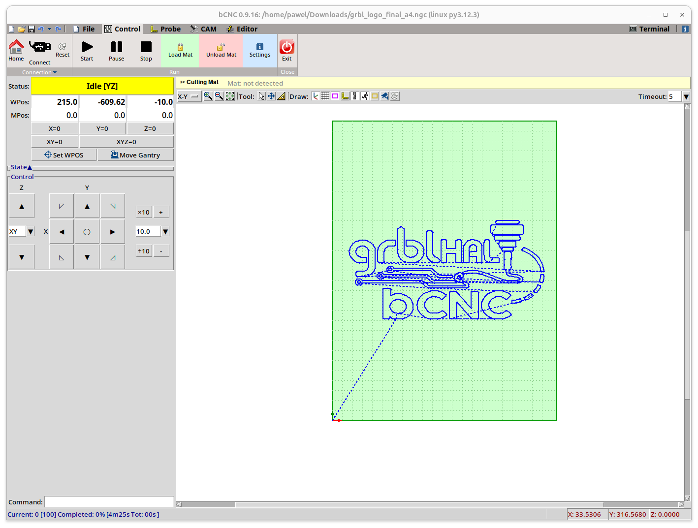

bCNC — Foil Cutting Plotter Edition
====================================

> **This is a fork of [bCNC](https://github.com/vlachoudis/bCNC) by
> [Vasilis Vlachoudis](https://github.com/vlachoudis), specialised for
> vinyl / foil cutting plotters.**
>
> A huge **thank you** to Vasilis for creating bCNC — a masterpiece of
> engineering that has empowered thousands of CNC hobbyists and
> professionals around the world.  His years of work, careful design and
> open-source spirit made this fork possible.  All credit for the
> foundation belongs to him. 🙏

---

## ✂️ What makes this fork different?

This fork extends the original bCNC with features specifically designed
for **drag-knife / foil cutting plotters** running **grblHAL**:

| Feature | Description |
|---|---|
| 🗡️ **Automated drag-knife compensation** | Knife offset is computed transparently at send-time — the editor always shows the original unmodified design |
| 🔄 **Overcut support** | Configurable overcut at path ends for clean corner separation |
| 🧩 **Cutting-mat management** | Visual mat overlay, load/unload workflow, automatic snap-to-mat-origin on file load |
| 📐 **Mat boundary check** | Warns before a job starts if the drawing exceeds the mat dimensions |
| 🔩 **grblHAL improvements** | Better alarm handling, correct G92 restore after reset, reliable post-alarm homing that returns to mat origin (Y=0) |
| 📱 **Tablet-friendly UI** | Simplified ribbon layout and larger touch targets for tablet / touchscreen use |
| 📏 **Scaling & basic shapes** | Built-in scaling tool and shape generators (rectangle, circle, line, arc …) for quick layout without a CAD app |
| 🎛️ **Pressure & speed per-mat** | Per-mat cutting pressure and speed stored in settings |
| 🖼️ **Live bitmap tracing** | Preview and generate vector contours, multi-threshold layers, Zhang–Suen centerlines, or a single Print Then Cut outline from bitmap artwork |

---

## 🖥️ Screenshot

*Plotter edition with cutting-mat overlay, grblHAL logo design loaded and ready to cut:*

---

## Apple/MacOS warning! We are working on new release and it seems to be broken on Mac, but have no way to test.
## If you use MacOS, plese contact us [HERE](https://github.com/vlachoudis/bCNC/issues/591) so we can keep Mac support!

GrblHAL (formerly GRBL) CNC command sender, autoleveler, g-code editor, digitizer, CAM
and swiss army knife for all your CNC needs.

An advanced fully featured g-code sender for grblHAL (formerly GRBL). bCNC is a cross platform program (Windows, Linux, Mac) written in python. The sender is robust and fast able to work nicely with old or slow hardware like [Raspberry Pi](http://www.openbuilds.com/threads/bcnc-and-the-raspberry-pi.3038/) (As it was validated by the GRBL maintainer on heavy testing).

## IMPORTANT! If you have any troubles using bCNC, please read [WIKI](https://github.com/vlachoudis/bCNC/wiki) and [DISCUSS](https://github.com/vlachoudis/bCNC/discussions) it first. Only create new [issues](https://github.com/vlachoudis/bCNC/issues) when you are certain there is a problem with actual bCNC code.

All pull requests that do change GUI should have attached screenshots of GUI before and after the changes.
Please note that all pull requests should pass the Travis-CI build in order to get merged.https://github.com/Harvie/cnc-simulator
Most pull requests should also pass CodeFactor checks if there is not good reason for failure.
Before making pull request, please test your code on ~~both python2 and~~ python3.

# Installation (using pip = recommended!)

This is a short overview of the installation process, for more details see the  wiki page.

This is how you install (or upgrade) bCNC along with all required packages.
You can use any of these commands (you need only one):

    pip install --upgrade bCNC
    pip install --upgrade git+https://github.com/vlachoudis/bCNC
    pip install . #in git directory
    python -m pip install --upgrade bCNC

This is how you launch bCNC:

    python -m bCNC

Only problem with this approach is that it might not install Tkinter in some cases.
So please keep that in mind and make sure it's installed in case of problems.

If you run the `python -m bCNC` command in root directory of this git repository it will launch the git version.
Every developer should always use this to launch bCNC to ensure that his/her code will work after packaging.

Note that on Windows XP you have to use `pyserial==3.0.1` or older as newer version do not work on XP.

PyPI project: https://pypi.org/project/bCNC/

# Installation (manual)
You will need the following packages to run bCNC
- tkinter the graphical toolkit for python
  Depending your python/OS it can either be already installed,
  or under the names tkinter, python3-tkinter, python-tk
- pyserial or under the name python-serial, python-pyserial
- numpy
- Optionally:
- python-imaging-tk: the PIL libraries for autolevel height map
- python-opencv: for webcam streaming on web pendant
- scipy: for 100 times faster 3D mesh slicing

Expand the directory or download it from github
and run the bCNC command

# Installation (Linux package maintainers)
- Copy `bCNC` subdirectory of this repo to `/usr/lib/python3.x/site-packages/`
- Launch using `python -m bCNC` or install bCNC.sh to /usr/bin
- Alternatively you can fetch the bCNC Python package using pip when building Linux package
  - refer to your distro, eg.: https://wiki.archlinux.org/index.php/Python_package_guidelines
  - Py2deb to build Debian package from Python package: https://pypi.org/project/py2deb/

# Installation (Compile to Windows .exe)

Note that you might probably find some precompiled .exe files on github "releases" page:
https://github.com/vlachoudis/bCNC/releases
But they might not be up to date.

This is basic example of how to compile bCNC to .exe file.
(given that you have working bCNC in the first place, eg. using `pip install bCNC`).
Go to the directory where is your bCNC installed and do the following:

    pip install pyinstaller
    pyinstaller --onefile --distpath . --hidden-import tkinter --paths lib;plugins;controllers --icon bCNC.ico --name bCNC __main__.py

This will take a minute or two. But in the end it should create `bCNC.exe`.
Also note that there is `make-exe.bat` file which will do just that for you.
This will also create rather large "build" subdirectory.
That is solely for caching purposes and you should delete it before redistributing!

If you are going to report bugs in .exe version of bCNC,
please check first if that bug occurs even when running directly in python (without .exe build).

# IMPORTANT! Motion controller configuration
- We strongly recommend you to use 32b microcontroller with FluidNC https://github.com/bdring/FluidNC http://wiki.fluidnc.com firmware for the new machine builds.
- In case you are using grblHAL https://github.com/grblHAL (Original GRBL firmware is still supported, but it is currently reaching the end-of-life due to limitations of 8b microcontrollers)
- GRBL should be configured to use **MPos** rather than **Wpos**. This means that `$10=` should be set to odd number. As of GRBL 1.1 we recommend setting `$10=3`. If you have troubles communicating with your machine, you can try to set failsafe value `$10=1`.
- CADs, bCNC and GRBL all work in millimeters by default. Make sure that `$13=0` is set in GRBL, if you experience strange behavior. (unless you've configured your CAD and bCNC to use inches)
- Before filing bug please make sure you use latest stable official release of GRBL. Older and unofficial releases might work, but we frequently see cases where they don't. So please upgrade firmware in your Arduinos to reasonably recent version if you can.
- Also read about all possible GRBL settings and make sure your setup is correct: https://github.com/gnea/grbl/wiki/Grbl-v1.1-Configuration
- GrblHAL also has "Compatibility level" settings which have to be correctly configured during firmware compilation: https://github.com/grblHAL/core/wiki/Compatibility-level

# Configuration
You can modify most of the parameters from the "CAM -> Config/Controller" page.
You can also enable (up to) 6-axis mode in Config section,
but bCNC restart is required for changes to take place.
Only the changes/differences from the default configuration
file will be saved in your home directory ${HOME}/.bCNC  or ~/.bCNC

The default configuration is stored on bCNC.ini in the
installation directory.

*PLEASE DO NOT CHANGE THIS FILE, IT'S GOING TO BE OVERWRITTEN ON EACH UPGRADE OF BCNC*

## External vector editors

The **LibreCAD** and **Inkscape** buttons open a new temporary DXF or SVG
drawing without showing a file dialog. Save the drawing and close the editor to
import its geometry into the current bCNC job. Configure the editor commands in
the Plotter Settings dialog; both editors are optional external dependencies.

## Bitmap tracing and Print Then Cut

Select **Editor → Bitmap** to open the **Trace Bitmap** window. Choose a PNG,
JPEG, BMP, GIF, TIFF, or WebP image and adjust the settings while the dialog
shows the source image with the generated vector paths overlaid in real time.

The tool supports four trace modes:

- **Contours** — closed vectors around dark artwork.
- **Multi-threshold** — nested vectors from several luminance levels, useful
  for layered artwork.
- **Centerline** — single-stroke vectors generated with Zhang–Suen
  skeletonization, with optional short-branch removal.
- **Print then cut** — one external closed loop around the isolated image,
  with an optional outward bleed for sticker cutting.

Use the automatic edge-background removal for artwork on a consistent
background. Tune its tolerance, threshold, minimum area, and smoothing until
the preview matches the intended cut. Click **Generate G-code** to insert the
traced paths into the current job; the generated outline can then use the
existing drag-knife compensation workflow.

# Features:
- simple and intuitive interface for small screens
- 3-axis and 6-axis GUI modes
- import/export **g-code**, **dxf** and **svg** files
- 3D mesh slicing **stl** and **ply** files
- fast g-code sender (works nicely on RPi and old hardware)
- workspace configuration (G54..G59 commands)
- user configurable buttons
- g-code **function evaluation** with run time expansion
- feed override during the running for fine tuning
- Easy probing:
  - simple probing
  - center finder with a probing ring
  - **auto leveling**, Z-probing and auto leveling by altering the g-code during
    sending (or permanently autoleveling the g-code file).
  - height color map display
  - create g-code by jogging and recording points (can even use camera for this)
  - **manual tool change** expansion and automatic tool length probing
  - **canned cycles** expansion
- Various Tools:
  - user configurable database of materials, endmills, stock
  - properties database of materials, stock, end mills etc..
  - basic **CAM** features (profiling, pocketing, drilling, flat/helical/ramp cutting, thread milling, cutout tabs, drag knife)
  - User g-code plugins:
    - bowl generator
    - finger joint box generator
    - simple spur gear generator
    - spirograph generator
    - surface flatten
    - play melody from MIDI file using stepper motor frequency
    - ...
- G-Code editor and display
    - graphical display of the g-code, and workspace
    - graphically moving and editing g-code
    - reordering code and **rapid motion optimization**
    - moving, rotating, mirroring the g-code
- Web pendant to be used via smart phones

# Debugging
You can log serial communication by changing the port to something like:

    spy:///dev/ttyUSB0?file=serial_log.txt&raw
    spy://COM1?file=serial_log.txt&raw

If a file isn't specified, the log is written to stderr.
The 'raw' option outputs the data directly, instead of creating a hex dump.
Further documentation is available at: https://pyserial.readthedocs.io/en/latest/url_handlers.html#spy

# Disclaimer
  The software is made available "AS IS". It seems quite stable, but it is in
  an early stage of development.  Hence there should be plenty of bugs not yet
  spotted. Please use/try it with care, I don't want to be liable if it causes
  any damage :)

# See also
  - G-code simulators that you can use to independently cross-check g-code generated by bCNC or verify any g-code files in case you have troubles running them.
    - https://harvie.github.io/cnc-simulator ([github](https://github.com/Harvie/cnc-simulator))
    - https://camotics.org
    - https://freecad.org
