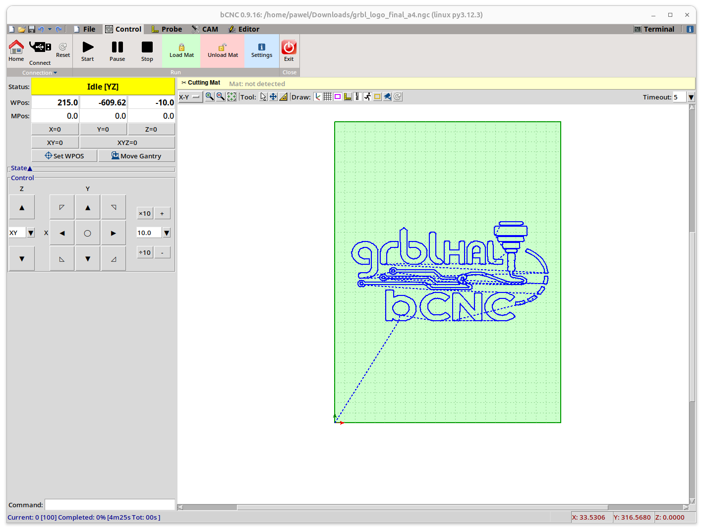

bCNC — Foil Cutting Plotter Edition
====================================

> **This is a fork of [bCNC](https://github.com/vlachoudis/bCNC) by
> [Vasilis Vlachoudis](https://github.com/vlachoudis), specialised for
> vinyl / foil cutting plotters.**
>
> A huge **thank you** to Vasilis for creating bCNC — a masterpiece of
> engineering that has empowered thousands of CNC hobbyists and
> professionals around the world.  His years of work, careful design and
> open-source spirit made this fork possible.  All credit for the
> foundation belongs to him. 🙏

---

## Foil Studio workspace

The default GUI now provides **Design → Prepare → Cut**, a large mat preview,
touch-sized editing controls, saved material presets, and a readiness review.
Advanced controls remain under **Advanced settings**. The implementation
continues to use the existing Python/Tkinter editor and GRBL sender.

The [architecture assessment and implemented plan](docs/plotter-architecture.md)
describes service boundaries, legacy adapters, and remaining migration candidates.

See the [workflow guide](docs/foil-studio-workflow.md) for loading profiles,
test cuts, compatibility limits, and validation. Manual positioning is the
default; select the grblHAL automatic loader only for firmware that implements
this fork's material-loading commands.


## ✂️ What makes this fork different?

This fork extends the original bCNC with features specifically designed
for **drag-knife / foil cutting plotters** running **grblHAL**:

| Feature | Description |
|---|---|
| 🗡️ **Automated drag-knife compensation** | Knife offset is computed transparently at send-time — the editor always shows the original unmodified design |
| 🔄 **Overcut support** | Configurable overcut at path ends for clean corner separation |
| 🧩 **Cutting-mat management** | Visual mat overlay, load/unload workflow, automatic snap-to-mat-origin on file load |
| 📐 **Mat boundary check** | Warns before a job starts if the drawing exceeds the mat dimensions |
| 🔩 **grblHAL improvements** | Better alarm handling, correct G92 restore after reset, reliable post-alarm homing that returns to mat origin (Y=0) |
| 📱 **Tablet-friendly UI** | Simplified ribbon layout and larger touch targets for tablet / touchscreen use |
| 📏 **Scaling & basic shapes** | Built-in scaling tool and shape generators (rectangle, circle, line, arc …) for quick layout without a CAD app |
| ✏️ **LibreCAD & Inkscape integration** | Open DXF or SVG drawings in external editors for extended 2D drawing capabilities, then save and close to import the geometry back into bCNC |
| 🎛️ **Pressure & speed per-mat** | Per-mat cutting pressure and speed stored in settings |
| 🖼️ **Live bitmap tracing** | Preview and generate vector contours, multi-threshold layers, Zhang–Suen centerlines, or a single Print Then Cut outline from bitmap artwork |

---

## 🖥️ Screenshot

*Plotter edition with cutting-mat overlay, grblHAL logo design loaded and ready to cut:*



---

## Development checks

Run the current test suite with:

```sh
xvfb-run -a python -W ignore::ResourceWarning -m unittest discover -s tests
```

The [regression workflow](.github/workflows/tests.yml) runs these checks without
physical hardware. Include screenshots when changing the GUI. Native installer
and physical cutter validation still require the corresponding platforms.

# Installation (using pip = recommended!)

This is a short overview of the installation process, for more details see the  wiki page.

This is how you install (or upgrade) bCNC along with all required packages.
You can use any of these commands (you need only one):

    pip install --upgrade bCNC
    pip install --upgrade git+https://github.com/vlachoudis/bCNC
    pip install . #in git directory
    python -m pip install --upgrade bCNC

This is how you launch bCNC:

    python -m bCNC

Only problem with this approach is that it might not install Tkinter in some cases.
So please keep that in mind and make sure it's installed in case of problems.

If you run the `python -m bCNC` command in root directory of this git repository it will launch the git version.
Every developer should always use this to launch bCNC to ensure that his/her code will work after packaging.

Note that on Windows XP you have to use `pyserial==3.0.1` or older as newer version do not work on XP.

PyPI project: https://pypi.org/project/bCNC/

# Installation (manual)
You will need the following packages to run bCNC
- tkinter the graphical toolkit for python
  Depending your python/OS it can either be already installed,
  or under the names tkinter, python3-tkinter, python-tk
- pyserial or under the name python-serial, python-pyserial
- numpy
- Optionally:
- python-imaging-tk: image previews and tracing
- python-opencv: for bitmap tracing

Expand the directory or download it from github
and run the bCNC command

# Installation (Linux package maintainers)
- Copy `bCNC` subdirectory of this repo to `/usr/lib/python3.x/site-packages/`
- Launch using `python -m bCNC` or install bCNC.sh to /usr/bin
- Alternatively you can fetch the bCNC Python package using pip when building Linux package
  - refer to your distro, eg.: https://wiki.archlinux.org/index.php/Python_package_guidelines
  - Py2deb to build Debian package from Python package: https://pypi.org/project/py2deb/

# Installation (Compile to Windows .exe)

Note that you might probably find some precompiled .exe files on github "releases" page:
https://github.com/vlachoudis/bCNC/releases
But they might not be up to date.

This is basic example of how to compile bCNC to .exe file.
(given that you have working bCNC in the first place, eg. using `pip install bCNC`).
Go to the directory where is your bCNC installed and do the following:

    pip install pyinstaller
    pyinstaller --onefile --distpath . --hidden-import tkinter --paths lib;plugins;controllers --icon bCNC.ico --name bCNC __main__.py

This will take a minute or two. But in the end it should create `bCNC.exe`.
Also note that there is `make-exe.bat` file which will do just that for you.
This will also create rather large "build" subdirectory.
That is solely for caching purposes and you should delete it before redistributing!

If you are going to report bugs in .exe version of bCNC,
please check first if that bug occurs even when running directly in python (without .exe build).

Automated Windows 11 and Ubuntu installer builds, including tagged GitHub Release
publishing, are documented in [packaging/README.md](packaging/README.md).

# Configuration

Use **Advanced settings** for application configuration, controller settings,
manual movement, System information, and job header/footer editing. The fork
supports GRBL0, GRBL1 and compatible grblHAL plotters with X/Y movement and Z
blade lift; camera alignment, six-axis controls and milling are not included.

User preferences are saved in `~/.bCNC`. System defaults are supplied in
`bCNC/bCNC.ini`; use the settings interface rather than editing installed defaults.
The [architecture assessment and implemented plan](docs/plotter-architecture.md)
describes service boundaries, legacy adapters, and remaining migration candidates.

See the [workflow guide](docs/foil-studio-workflow.md) for setup and limitations.

## External vector editors

The **LibreCAD** and **Inkscape** buttons open a new temporary DXF or SVG
drawing without showing a file dialog. Save the drawing and close the editor to
import its geometry into the current bCNC job. Configure the editor commands in
the Plotter Settings dialog; both editors are optional external dependencies.

## Bitmap tracing and Print Then Cut

Select **Editor → Bitmap** to open the **Trace Bitmap** window. Choose a PNG,
JPEG, BMP, GIF, TIFF, or WebP image and adjust the settings while the dialog
shows the source image with the generated vector paths overlaid in real time.

The tool supports four trace modes:

- **Contours** — closed vectors around dark artwork.
- **Multi-threshold** — nested vectors from several luminance levels, useful
  for layered artwork.
- **Centerline** — single-stroke vectors generated with Zhang–Suen
  skeletonization, with optional short-branch removal.
- **Print then cut** — one external closed loop around the isolated image,
  with an optional outward bleed for sticker cutting.

Use the automatic edge-background removal for artwork on a consistent
background. Tune its tolerance, threshold, minimum area, and smoothing until
the preview matches the intended cut. Click **Add to mat** in Foil Studio to insert the
traced paths into the current job; the generated outline can then use the
existing drag-knife compensation workflow.

# Supported plotter features

- Design → Prepare → Cut workspace with mat preview and GRBL/grblHAL streaming.
- SVG, DXF and G-code artwork; vector text, bitmap tracing and basic shapes.
- Arrange, weld, difference, intersection, exclusion, concatenation and undo.
- Material pressure/speed presets, drag-knife offset/overcut and calibration cuts.
- Advanced editable job header/footer, with optional defaults for new designs.
- Friendly connection, alarm and internal-error handling with technical details.
- Machine diagnostics retains the raw editor and shared machine controls.

Non-GRBL controllers, 3D slicing and retired generators have been removed.
See the [core cleanup analysis and plan](docs/plotter-core-cleanup.md) for the
removal inventory and the remaining shared-core dependencies.

# Debugging
You can log serial communication by changing the port to something like:

    spy:///dev/ttyUSB0?file=serial_log.txt&raw
    spy://COM1?file=serial_log.txt&raw

If a file isn't specified, the log is written to stderr.
The 'raw' option outputs the data directly, instead of creating a hex dump.
Further documentation is available at: https://pyserial.readthedocs.io/en/latest/url_handlers.html#spy

# Disclaimer
  The software is made available "AS IS". It seems quite stable, but it is in
  an early stage of development.  Hence there should be plenty of bugs not yet
  spotted. Please use/try it with care, I don't want to be liable if it causes
  any damage :)

# See also
  - G-code simulators that you can use to independently cross-check g-code generated by bCNC or verify any g-code files in case you have troubles running them.
    - https://harvie.github.io/cnc-simulator ([github](https://github.com/Harvie/cnc-simulator))
    - https://camotics.org
    - https://freecad.org
