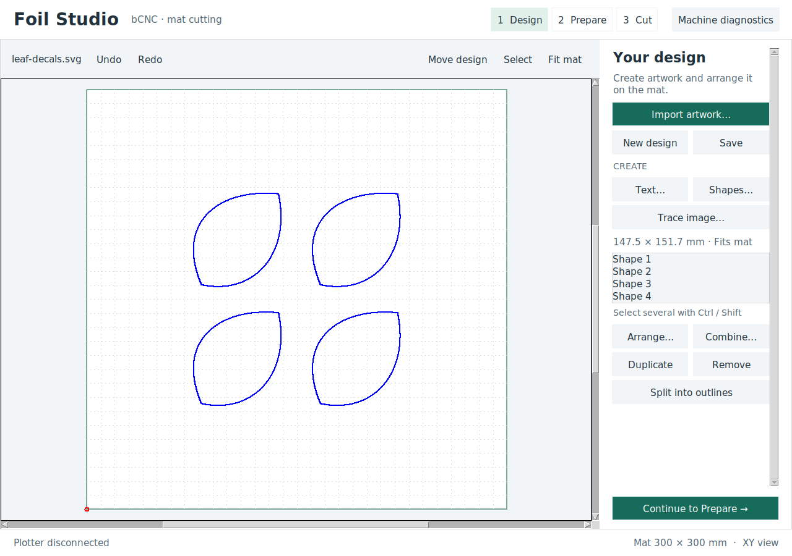

# Foil Studio — Classic

Design → Prepare → Cut for foil and vinyl plotters. This is the maintained
Python/Tk application, derived from [bCNC](https://github.com/vlachoudis/bCNC)
by Vasilis Vlachoudis and contributors. Original copyright and license notices remain.

| Branch | Status | Releases |
| --- | --- | --- |
| [`foilstudio`](https://github.com/pratanczuk/bCNC/tree/foilstudio) | Working Python/Tk application | `foilstudio-v*` release candidates |
| [`next`](https://github.com/pratanczuk/FoilStudio/tree/next) | Flutter/Rust development | `next-v*` prereleases |

[Downloads](https://github.com/pratanczuk/bCNC/releases) ·
[Builds](https://github.com/pratanczuk/bCNC/actions) ·
[Application tour manual](docs/Foil-Studio-Application-Tour.mp4) ·
[Workflow guide](docs/foil-studio-workflow.md) ·
[Development and releases](docs/development.md)



## Run from source

Use Python 3.12 for wheel builds. On Ubuntu install `python3-tk`, then in a virtual environment:

```sh
python -m pip install -c packaging/constraints.txt .
foil-studio
```

The internal package remains `bCNC`; `bCNC` is retained as a command alias.
See [packaging](packaging/README.md) for OS dependencies and installers.
Use a supported machine profile; automatic material loading requires compatible firmware.

## Licensing and release status

See [LICENSE.md](https://github.com/pratanczuk/bCNC/blob/foilstudio/LICENSE.md) and the
[existing license review](https://github.com/pratanczuk/bCNC/blob/foilstudio/docs/foil-studio-license-review.md).
Foil Studio binary release candidates are published for evaluation. The recorded
dependency and provenance questions remain open; a published release and green CI run
are not physical-cutting validation or license clearance.
