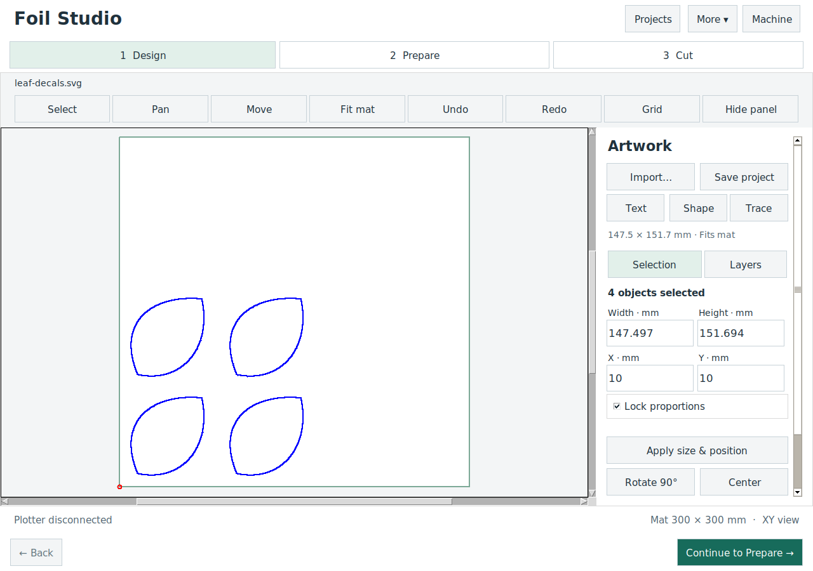
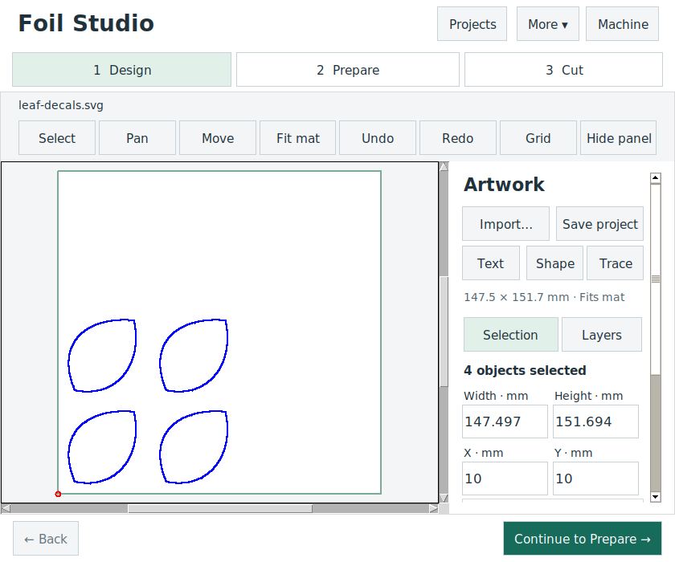
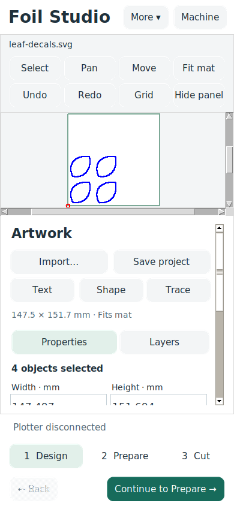

# Adaptive GUI implementation

## Local checkpoints

- `old-gui` is an annotated local tag at `c37348a`, preserving all code, documentation and artifacts present before implementation.
- The redesign is the default application UI. No remote push is part of this work.

## Implemented

- A shared visual style for buttons, editable fields, checkboxes, notebooks, selection, focus and progress.
- Separate workflow navigation, contextual Properties / Layers panels, a compact tool row, Projects / More menus and a dedicated Machine window.
- Desktop side inspector; stacked inspector and bottom workflow navigation below 760 logical pixels. The inspector can be collapsed to enlarge the mat.
- Exact numeric width, height and position editing, decimal-comma support, aspect locking, validation and a single undo transaction. An empty selection never implicitly edits the entire design.
- Touch-friendly explicit multi-selection, Select all / Clear, numeric alternatives to canvas dragging, Select / Pan / Move modes and an adaptive, toggleable mat grid.
- A fixed action area outside the scrolling inspector. During a job it shows Pause / Stop without competing Back / Next buttons. Mat movement uses the mat cancellation service; tool sequences use their existing cancellation service.
- Preview tools reflow between two columns and stacked preview/form panes. Layers use fewer table columns at compact widths, with full properties still available in the detail panel.
- The material/tool library reflows to stacked list/detail panes. Connection setup scrolls while its Connect / Close actions remain available.
- Settings use a flat category picker for pressure, blade, mat, job commands, planning defaults, machine control and language/support. Existing application/controller settings retain separate scopes.
- Error details, validation, recovery copies, first-cut guidance, material/tool libraries and all existing geometry tools continue using their existing services.
- Application and Machine-window timer cleanup prevents callbacks outliving closed windows.

## Scope and platform limits

This is a working redesign of the existing **Tk desktop application**, preserving its Python document, planning, serial/TCP and job services. It is not a port to Flutter or a browser application. Compact layouts are tested in desktop virtual displays; this does not make Tk an Android/iOS application or prove on-device touch/keyboard behavior.

Native phone packaging, a separately owned mobile gateway, multi-touch gestures and system-following dark appearance remain platform/design follow-ups. The visual proposal is the direction; existing specialized geometry dialogs still use their established transaction semantics. No physical cutting or machine movement was performed by this implementation's tests.

## Coverage contract

Coverage is collected for **all `bCNC` application Python modules**. The enforced **greater-than-90% line coverage** gate covers the workflow and dialog UI modules listed in `tools/check_gui_coverage.py`, including both the new UI and reused editors. The complete application number is reported separately; the legacy canvas, application orchestration, sender and bundled geometry libraries are not claimed to exceed 90%.

No coverage exclusions were added to reach the target; the UI report has zero excluded lines. Tests construct real Tk widgets under Xvfb, edit real document geometry, exercise undo/error paths and verify commands through mocked/loopback transports. The new tests add compact-layout, explicit-selection, machine-control and lifecycle checks. Existing regression assertions changed only where navigation, scrolling or explicit-selection behavior intentionally changed.

Validation on 15 September 2026: **265 tests passed**; workflow/dialog UI line coverage **91.65%** (3,216 / 3,509 lines); new modules `PlotterAdaptive`, `PlotterUI` and `PlotterMachineUI` **100%**; complete application line coverage **71.63%**. Syntax compilation and `git diff --check` also passed.

Run from the repository root:

```bash
.venv/bin/python -m pip install -r requirements-test.txt
xvfb-run -a .venv/bin/python -m coverage run --source=bCNC -m unittest discover -s tests
.venv/bin/python tools/check_gui_coverage.py
```

The gate writes the complete application and UI JSON reports to `artifacts/coverage/`, and a browsable full report to `htmlcov/index.html`. The regression workflow runs the same gate.

## Launch

```bash
.venv/bin/python -m bCNC -S
```

`-S` disables automatic connection for that launch. Use the normal launch command when automatic connection is desired.

## Screenshots of the implemented application

These are real Tk renders under Xvfb, not the HTML concept.







Other captures: [Prepare](../screenshots/adaptive-prepare-desktop.png), [Cut](../screenshots/adaptive-cut-desktop.png), [Shape](../screenshots/adaptive-shape-compact.png), [Layers](../screenshots/adaptive-layers-compact.png), [Library](../screenshots/adaptive-library-compact.png), [Settings](../screenshots/adaptive-settings-compact.png), [Connection](../screenshots/adaptive-connection-compact.png), [Machine](../screenshots/adaptive-machine-compact.png).

## Panel visibility correction

Hide panel now collapses the inspector at desktop, tablet and compact widths, gives its space to the canvas, and preserves the hidden state across layout breakpoints. Show panel restores it. The former Selection tab is named Properties: it edits the selected artwork; the toolbar Select control selects artwork on the mat. Real-widget regressions cover both controls.
