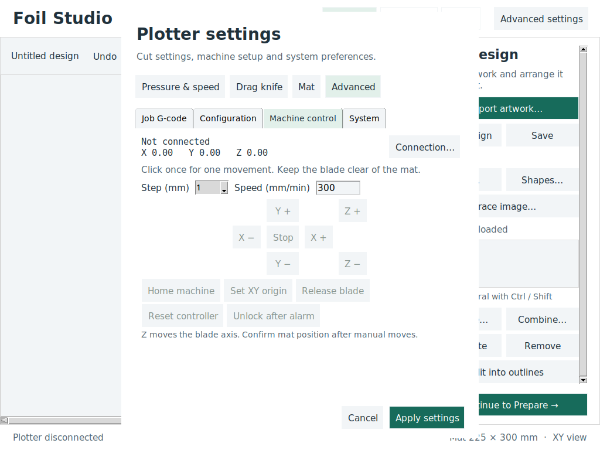

# Foil Studio workflow

The default desktop view now follows **Design → Prepare → Cut**. This first
implementation uses Tkinter and the existing geometry and sender code; it does
not introduce another serial connection or require Qt.

## Everyday use

1. In **Design**, import SVG, DXF, or a cut file. Artwork is placed with a 10 mm
   inset when it fits, leaving room for blade compensation. Text and bitmap tracing use the
   existing generators. Select objects in the list or on the mat; rotate, mirror,
   resize with locked proportions, center, duplicate, or remove them. If nothing
   is selected, transforms apply to all enabled artwork. Header/footer commands
   are excluded. Save uses the existing cut-file format, not a new project format.
2. In **Prepare**, connect the plotter, check mat/blade settings, and select or
   save a material preset. Presets hold cutting speed and PWM pressure separately
   from mat dimensions and blade offset. Saved presets are retained in the user
   configuration when the application closes normally.
   **Pressure…**, **Drag knife…**, and **Mat dimensions…** open the corresponding
   settings tabs. Blade-holder presets save offset, overcut, and compensation
   independently of material pressure/speed. All edits and blade-preset saves are
   staged: Apply validates the entire draft, while Cancel leaves live settings
   and mat confirmation unchanged. Geometry changes require a new mat
   confirmation; changing material values does not alter the source artwork.
3. Select a loading method. **Manual positioning** works without proprietary
   material-loading commands: position the mat yourself and use **Set mat origin
   here** to issue `G92 X0 Y0`. **grblHAL automatic loader** requires the firmware
   extensions `$HX`, `$LOAD_MATERIAL`, and `$UNLOAD_MATERIAL`. Selecting a profile
   does not detect or install these firmware extensions.
4. Wait for the machine to be idle, then confirm that the mat is loaded and
   aligned. Sensor presence is displayed separately and is not taken as proof
   of alignment. Unload in manual mode clears the origin; it does not move the
   mat or lift a Z-actuated blade. Lift the blade before removing the mat.
5. In **Cut**, review readiness and start. Pause/resume and Stop remain available
   during the job. Progress reports acknowledged commands, not a time estimate
   or a claim that every buffered move has physically completed.

In Prepare, **New pressure & corner test** creates a separate job containing a
10 mm square, circle, and triangle. The normal save/discard/cancel prompt protects
unsaved artwork; creating this job does not start motion. Review setup and mat
position, then start through Cut. Inspect whether the square peels cleanly without
cutting the backing, and inspect curves, triangle corners, and joined ends before
cutting the full design. Calibration is available from Prepare to keep it separate
from artwork.

Pressure uses the fork's existing **0–1000 PWM command scale**, not calibrated
grams. Set blade exposure mechanically and tune pressure with small test cuts;
the −25/+25 buttons edit the draft only. Apply sends no immediate pressure command:
the next workspace job receives the chosen setting. Use the holder's specified
offset as a starting point and test overcut for complete separation of closed
outlines. Enable compensation for original outlines; disable it for files already
compensated for a drag knife. Hardware force calibration remains future work.

Example artwork: [leaf-decals.svg](examples/leaf-decals.svg).

## Drawing and lettering

The Design panel groups equal-width buttons into creation and selection actions.
**Arrange…** contains sizing, rotation, placement, centering, and flips in an aligned
form. Undo/Redo are beside the canvas; calibration is in Prepare. The primary
Design actions fit a 1024×768 screen without scrolling in the default layout.

**Trace image…** opens the Foil Studio tracing window. Basics contains image size,
darkness threshold, inversion, and background removal. Refine contains smoothing,
speck removal, tolerance, and method-specific controls for multiple shades,
centerlines, or an outer silhouette. Original/Outline switches the preview.
The outer-silhouette option does not provide print registration.

Previews use an image no larger than 760 pixels on its longest side; **Add to mat**
retraces the full-resolution image and adds one undoable vector object at the
standard mat inset. Invalid settings, missing images, empty traces, and oversized
outlines leave the artwork unchanged and display an inline message. Blade pressure
and speed remain in Prepare; the tracing window does not send machine commands.
All tracing entry points use the modern preview dialog.

**Text** opens a multiline lettering editor with searchable font family/style
names, a scrollable font list, TTF/OTF file browsing, and a debounced outline
preview. Font size is em height; the preview reports the actual outline dimensions.
The selected font and size are remembered after insertion. Text is inserted as
ordinary vector artwork, not a persistent editable text object. Use Undo to
remove an insertion; editing wording after insertion still requires creating new
lettering. Advanced text shaping and rich text formatting are not implemented.

**Add a shape…** creates rectangles, circles, ellipses, triangles, and stars with
explicit dimensions and a preview. Creation adds one undoable object at a 10 mm
mat inset and rejects invalid or oversized dimensions. Circle/ellipse outlines
are approximated with straight segments to a maximum 0.02 mm chord error.

**Size & arrange** provides proportional width, arbitrary rotation, explicit
left/bottom placement, horizontal/vertical flips, and centering. Actions apply
to the indicated selection and can be undone. Duplicate, Remove, Undo, and Redo
remain available in the Design panel. Coordinates are in millimeters from the
mat origin; rotation is relative to the current selection's center.

Select multiple objects with Ctrl/Shift in the design list, then use
**Combine shapes…**:

| Operation | Result |
| --- | --- |
| Join / weld | Union: merges overlapping areas. |
| Subtract | Difference: removes every other selected object from the base. |
| Intersect | Keeps only the area shared by all selected objects. |
| Exclude overlap | Symmetric difference: keeps areas covered an odd number of times. |
| Combine outlines | Concatenates paths into one object without removing overlaps. |

The base follows design-list order and is named in the dialog. **Reverse object
order** changes it. The preview shows the proposed result before replacing
anything. Empty results explicitly state that applying removes the selected
objects. One Undo restores all original objects, including empty-result cases.
The result inherits the base object's enabled state, pass count, and color.

Boolean operations support compound outlines with holes using even/odd filling,
including letter counters. They require closed, non-self-intersecting contours;
invalid input produces an inline error. They use the existing Shapely dependency
and flatten arcs to chords at most 0.04 mm long (deviation at most 0.02 mm).
Concatenation preserves original path geometry and can include open paths.
**Break apart outlines** separates a compound object into independent paths in
one undoable action; former hole boundaries become independent objects.

These are the implemented drawing operations. Node editing, freehand drawing,
offset/inset tools in the modern workspace, and persistent editable text remain
future work; supported artwork tools are available in Design.

## Readiness and preparation

**Connection…** now opens a Foil Studio dialog with USB/serial port refresh,
manual port entry, baud rate, and GRBL0/GRBL1 selection. It uses the existing
sender and serial configuration; settings are retained on normal application
exit. Opening a port does not imply readiness: Start still requires an Idle
status report. Connection changes are blocked while cutting.

Connection failures, command errors, alarms, and unexpected disconnects appear
in a persistent recovery card. The card explains the problem in plain language
and offers a context-specific next action. Missing ports, access permissions,
busy connections, disconnects, alarms, and invalid cut preparation have distinct
guidance. Raw error text and diagnostics are available under **Show details**,
collapsed by default for each new error. Closing the card only hides it.
Alarm recovery offers **Unlock after inspection**, which explicitly
requests `$X`; it does not home, restore lost position, or confirm the mat.
Dismiss only hides the message. It never clears the controller's fault.

Serial read, polling, and write exceptions stop local streaming, clear unsent
commands, and close the failed port without accessing Tk from the worker thread.
Commands already buffered in the controller may still execute after USB loss.
There is no automatic reconnect or cut restart. Inspect the machine, reconnect,
restore its origin when necessary, and confirm the mat before another cut.
Core application errors also use this presentation from diagnostics. Errors raised
inside a modal editor get a matching dialog so the message remains accessible
without discarding the editor's draft. Startup failures before the workspace is
created retain the standard fallback error dialog.

GRBL/grblHAL alarm codes 1–22 have specific guidance; command errors use recovery
categories with a generic fallback for unknown or firmware-specific values. The
mapping follows the upstream [grblHAL alarm definitions](https://github.com/grblHAL/core/blob/master/alarms.h)
and [command status definitions](https://github.com/grblHAL/core/blob/master/errors.h).
Critical hardware faults, homing-required states, and unknown alarms do not offer
a generic Unlock shortcut. No alarm action automatically resets or resumes motion.

Unexpected Tk callback and serial-monitor errors retain their traceback in Details.
Preview failures keep the draft open with a plain-language message and a details
button. During a cut, an unexpected application error clears unsent commands and
requests a controller hold; it does not claim that physical motion has stopped.
Repeated identical notices keep their current details visibility instead of
resetting the card on each update.

- The workspace Start button and the existing keyboard Start action share the
  same readiness policy: connected, idle, no pending commands, valid artwork,
  artwork inside the mat, and explicit mat-position confirmation.
- Loading no longer marks the mat loaded before motion completes. Disconnects,
  resets, errors, mat-size changes, and manual machine actions invalidate
  confirmation. Confirmation is intentionally not persisted across sessions.
- Material speed and pressure are applied to a disposable sending buffer. Feed
  values are converted for inch-mode cut files. Original source artwork stays
  editable; these overrides apply to runs from the cutting workspace.
- Knife compensation is computed before starting the sender. Failures restore
  source blocks, undo/redo, dirty state, and selection. Requested compensation
  cannot silently fall back to an uncompensated job when no result is generated.
- Planar line/arc cutting bounds, including compensation and repeated relative
  passes, are checked before queuing. This is a **cutting-geometry check**, not a
  complete simulation of homing, rapid travel, blade height, or physical material
  coverage. Runtime expressions, extra axes, and unsupported motion modes need
  review before running. Autolevel maps are not supported by this workflow.
- The application workspace uses millimeters. The existing engine may still
  read inch-mode G-code; applying Configuration keeps the application in millimeters.

## Compatibility and remaining work

**Advanced settings** replaces the Machine diagnostics toggle. The design canvas
stays in place; there is no legacy ribbon workspace or alternate cut path.

- **Job G-code:** multiline header/footer editing and defaults for new designs.
- **Configuration:** validated application travel, feed, acceleration, precision
  and initialization settings; a separate controller tab reads actual `$$`
  responses and sends only the selected setting. Application Apply sends no
  controller commands. Read again to verify a controller write.
- **Machine control:** position/state, connection setup, step/speed, XY and Z jog,
  stop, home, XY origin, blade release, reset and guarded unlock. Motion requires
  an idle connection and an empty sender queue. GRBL1/grblHAL uses bounded `$J`
  jogs; GRBL0 uses finite feed moves and restores units/distance mode.
- **System:** language including system default, connection-log viewing/copying,
  and read-only user/system configuration files. Preferences save through the
  application's normal settings persistence on exit.

Retired: diagnostic CAM/Database/Config ribbons, camera setup, raw terminal
command entry as a product feature, duplicate raw drawing controls, color/font
and shortcut editors, external start/stop shell hooks, six-axis and laser-mode
options, and global keyboard jogging. The standard design undo/save shortcuts
remain. Low-level hidden Tk widgets still provide editor and serial-monitor
callbacks; they are implementation dependencies, not an exposed second UI.

Startup loads GRBL0/GRBL1 and the supported cutting plugins. Milling, probe maps,
orientation and web pendant paths were removed in the
[core cleanup audit](plotter-core-cleanup.md). Physical cutter and platform-specific
installer validation remain separate from GUI and simulated-controller tests.

## Validation

Run from the repository using an environment with the application dependencies:

```sh
xvfb-run -a python -m unittest tests.test_plotter_workflow
python -m unittest tests.test_dragknife_presend tests.test_font_text tests.test_imagetrace tests.test_path_boolean
python -m bCNC --package-smoke-test
```

The workflow tests instantiate the real Tk application/editor with an isolated
configuration and no hardware connection. They cover navigation, diagnostics,
editing, readiness, material overrides, geometric bounds, and compensation
restoration. Physical plotter testing is still required before using the new
workflow for production cuts.

### Advanced settings preview



Configuration and System use the same compact dialog. Verified at 1024×768.

### Automatic mat handling

Prepare defaults to **Automatic (detect plotter)**. A detected `GRBLFilmCut`
board uses its material-loader commands; other boards use manual positioning.
An explicit manual preference remains available.

Load and unload release the blade and home X automatically. Each step must finish
and report idle before the next command is sent. Loading establishes the mat
origin only after the firmware confirms successful material loading. Confirm
alignment yourself before cutting. Unloading clears the temporary origin after
successful ejection. Insert the mat until the material sensor detects it before
starting either automatic operation.

During movement the controls are locked and **Stop mat movement** is available.
Stopping resets the controller and requires checking and reloading the mat.
The app bounds material travel by configured mat height plus 60 mm and also
checks timeouts. Loader failures appear in the shared user-friendly error area.

### Materials, knives and pens

Open **Prepare → Materials & tools…** to add, edit/rename, duplicate or delete
profiles. Edit the Name field and save to rename a profile. Existing pressure /
speed and blade-holder presets migrate into the libraries.

Materials store speed, pressure, passes, thickness, compatible tool type and
notes. Pressure is the controller's 0–1000 PWM value, not grams. Thickness is
reference information; it does not move a Z axis. Knives store angle, blade
offset, overcut and compensation. Pens store color, stroke width and notes.
Width describes the fitted physical pen; it does not expand paths or create fills.

In **Layers & objects**, select a layer and set **Cut** with a knife or **Draw**
with a pen. Choose a material and **Apply material & tool**. These assignments
are undoable and saved inside `.foil` projects as profile snapshots. Renaming,
editing or deleting a library entry does not silently change existing projects;
apply the profile to the layer again to update it. Current settings removes the
layer override and returns it to the current knife settings. A layer material
multiplies its object's pass count, with a combined limit of 100.

**Pen safety:** validation forces compensation off, offset zero and overcut zero.
The planner separately bypasses knife compensation for every pen path, even if
global compensation is enabled or imported profile values say otherwise. Pen
and assigned knife passes use M5 before XY travel, M3/S for the outline, and M5
at the end. Their generated paths do not command Z movement. Custom job headers
and footers remain user-controlled.

With **All included layers**, a FilmCut plotter runs a guided multi-tool sequence:
pens first, then knives. All passes are prepared and validated before any motion.
Before fitting the first tool and before every subsequent exchange, the app
releases the tool, homes **X only**, and restores the job's work coordinates.
The mat axis is not homed or unloaded. Keep the mat and its position unchanged.

The sequence pauses at **Tool fitted and aligned; mat unchanged**. Tick it and
press **Continue with this tool** to run that pass. Finishing a pass automatically
prepares the next exchange, but never starts the next tool without confirmation.
Controls for editing, jogging and unloading are locked while the sequence is
active. Cancel sequence is available; alarms, resets, disconnects or unexpected
movement abort the remaining sequence. No sequence resumes automatically.

The user header runs with the first pass and footer with the final pass. Guided
sequences reject coordinate-system changes or homing in the startup/header,
since these invalidate the preserved job origin. Cut preview shows all passes
in execution order; it does not simulate the exchange homing travel.

Other controller profiles currently use individual tool passes, because X-only
homing is only verified for FilmCut. Selecting a particular **Tool pass** keeps
the independent-pass workflow. G-code export requires choosing one tool pass;
an exported file cannot provide the app's interactive tool-change confirmations.

Layer tool processing uses editable vector artwork (SVG/DXF, text and shapes).
Arbitrary imported machine G-code remains supported through Current settings;
it is not silently rewritten into pen paths. Assignments are validated before
sending, and errors such as incompatible materials or empty tool passes stop
preparation without issuing movement commands.

### Mat handling from the final step

Review and cut contains its own Load/Unload button and alignment checkbox near
the top. On FilmCut, successful loading switches the button to Unload. Ejection
or sensor-confirmed removal returns it to Load; reinserting the mat leaves Load
available until the loading operation completes. Movement progress and Stop mat
movement are also available here. Load does not automatically confirm alignment:
tick **Mat is loaded and aligned** when ready. The start button then becomes
available if the remaining connection, job and tool checks pass.

Materials & tools is also available at the bottom of every Settings page.
Closing the library restores the Settings dialog and preserves its unsaved
fields; the blade-preset list refreshes to include library additions and removals.

### Job defaults and current-settings outlines (2026-09-15)

New jobs start with `M5` and `G21 G90 G17 G94`, and finish with `M5`.
Homing, mat movement and tool-exchange parking remain controlled application
operations. Defaults no longer include `$H`, `$G`, fixed pressure/feed, dwell,
or a return to Y zero.

Vector artwork using Current settings now shares the layer-profile path generator:
release, travel to the outline, apply the selected pressure, draw/cut at the selected
speed, release. Knife compensation, overcut, inner-first ordering, material passes
and object passes apply through the same planner. Source artwork is not changed.

Imported raw machine G-code retains its explicit commands (material overrides still
apply when enabled). Jobs mixing raw command blocks and vector artwork must be run
separately; the planner rejects that mixture rather than guessing tool/motion modes.

On preferences load, exact known former header/footer templates are upgraded.
Custom templates and existing project header/footer blocks are preserved. Restart
and create a new design to use the new defaults; older projects can be edited in
Advanced → Job G-code. Normal configuration saving retains its pre-cleanup backup.
